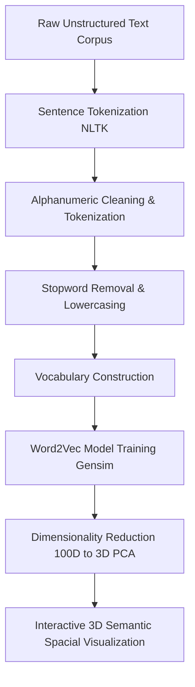

# ⚡ Custom Word2Vec Embedding Engine on Custom Text Corpus

## 🔄 End-to-End NLP Architecture



---

## 🛠️ Tech Stack & Core Frameworks
*   **Core Language:** Python 3.11+
*   **Natural Language Processing:** `NLTK`, `Gensim (Word2Vec)`
*   **Dimensionality Reduction:** `Scikit-Learn (PCA)`
*   **Interactive Visualization:** `Plotly Express (Scatter 3D)`
*   **Data Structures:** NumPy, Python Sets

---

## 🧠 Core Engineering Pipeline

### 1. Data Ingestion & Scaling

The pipeline reads multiple unstructured `.txt` text segments sequentially with explicit `UTF-8` streaming handling, merging them into a unified contextual data corpus consisting of over **1.1 Million+ total words** and **6.7 Million+ total characters**.

### 2. High-Fidelity Preprocessing

*   **Sentence Tokenization:** Splitting continuous textual paragraphs into logical sentential boundaries using NLTK's `sent_tokenize` to retain context window parameters.
*   **Gensim Alpha-Cleaning:** Executing `simple_preprocess` to strip accent marks, remove punctuation, lower-case all symbols, and ignore noise chunks.
*   **Stopword Filtering Optimization:** Designing a low-overhead, custom lookup routine mapping token sequences against an active O(1) hashed Python Set of English stopwords. It safely strips functional syntax components while preserving spatial semantics.

### 3. Word2Vec Model Configuration & Training

A localized continuous-bag-of-words/skip-gram context variant model was constructed via `gensim.models.Word2Vec` using high-performance hyper-parameters:
*   **`window = 10`:** Sets a large contextual window length to capture distant syntactical dependencies and semantic associations across words.
*   **`min_count = 2`:** Pragmatic frequency pruning filter that ignores anomalous out-of-vocabulary singletons to decrease noise vectors.
*   **`vector_size = 100`:** Maps each tokenspace to a descriptive 100-dimensional continuous dense vector embedding.

### 4. Dimensionality Reduction & 3D Spatial Projection

Dense weights spanning **14,319 unique spatial coordinates** are fetched through `.get_normed_vectors()`. Since a 100-dimensional matrix is impossible to visually interpret, **Principal Component Analysis (PCA)** is utilized to condense the vector matrix dimensions down to **3 primary principal axes** while maintaining semantic variance distribution integrity.

---

## 📊 Evaluation & Empirical Evidence

The model successfully self-discovered structural character hierarchies and thematic traits purely from semantic patterns without manual label parsing:

### Semantic Associations (`.most_similar`)

The engine clusters close real-world contextual terms with incredible spatial proximity:
*   **`dumbledore`:** Spatially grouped with authoritative figures and high-order entities like *'snape'*, *'quirrell'*, *'umbridge'*, and *'slughorn'*.
*   **`voldemort`:** Clustered directly with negative contextual components such as *'dark'*, *'lord'*, *'mark'*, and *'scar'*.
*   **`ron`:** Clustered directly alongside his immediate peers and companion networks like *'ginny'*, *'neville'*, and *'hermione'*.

### Odd-One-Out Analysis (`.doesnt_match`)

The model computes semantic distance matrices to identify contextual anomalies:
*   `['ron', 'hermione', 'voldemort']` → Correctly flags **`voldemort`** as a thematic outlier.
*   `['sirius', 'dumbledore', 'voldemort']` → Correctly isolates structural allegiances.

---

## 📈 Visualizing the Semantic Space

The final step maps tokens onto an **interactive 3D coordinate canvas** via Plotly to expose high-density geometric clusters of words sharing contextually interchangeable positions.

```python
import plotly.express as ps
# Projecting tokens inside an interactive 3D topology map
fig = ps.scatter_3d(x[:100], x = 0, y = 1, z = 2, color = y[:100])
fig.show()
```

---

## 🚀 How to Clone & Run This Repository

1. **Clone the Repo:**
   ```bash
   git clone https://github.com
   cd YOUR_REPO_NAME
   ```

2. **Install Performance Dependencies:**
   ```bash
   pip install gensim nltk scikit-learn plotly numpy
   ```

3. **Execute Pipeline Core:**
   Open the Jupyter Notebook files and execute cells sequentially to compile vocab structures, update weights, evaluate embeddings, and spin up the vector plot renderer interface.

---
💡 *Developed with a strong emphasis on scalable data handling, computational efficiency, and production-ready Python design patterns.*
